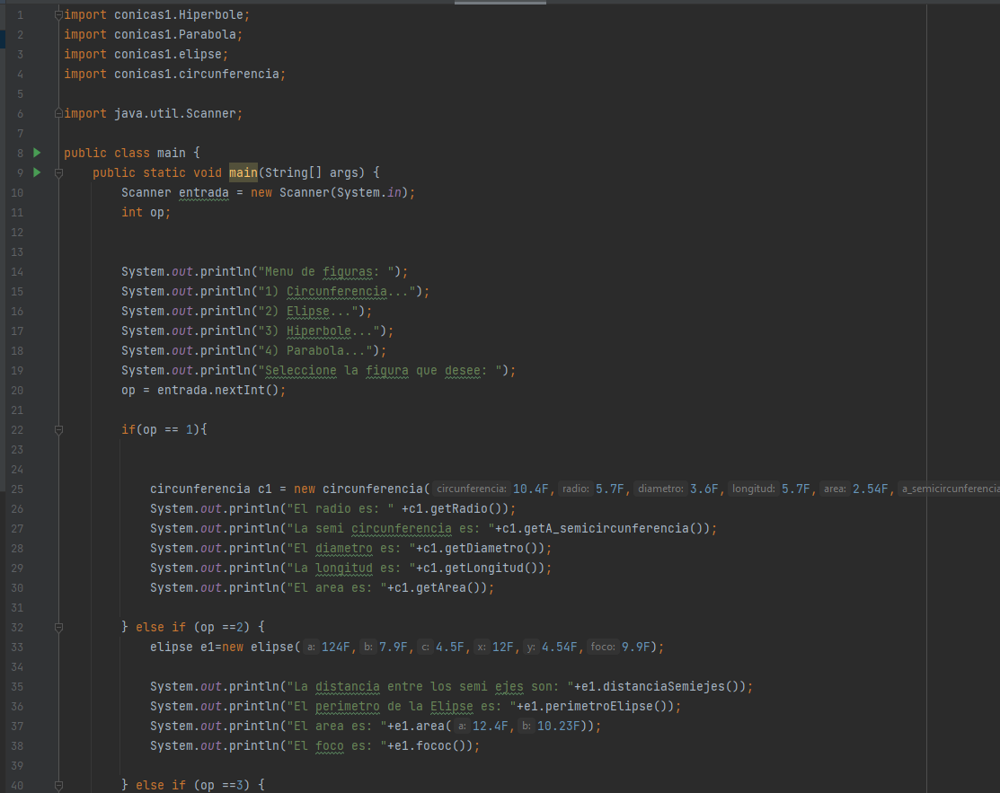
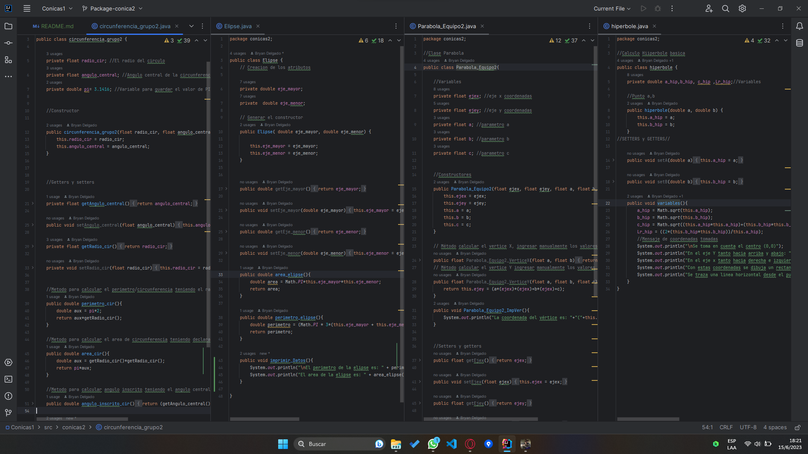

# Packages en Java
Realizado por: Andrew Vilcacundo
Fecha: 20-Junio-2023

## Capturas del programa en ejecución

 1. Código del Main
	
    2. Package del Equipo 1
    
 3. Ejecución del archivo Main:
	1. Main:
	
	2. Parábola:
	
	3. Hipérbola:
	
	4. Circunferencia:
	
	5. Elipse:
	

